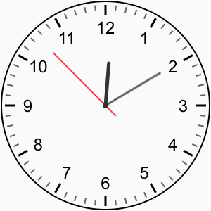
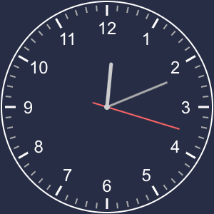

# MoonShine Analog Clock Component

[](https://packagist.org/packages/akostdev/moonshine-clock-component)
[](https://packagist.org/packages/akostdev/moonshine-clock-component)

An elegant analog clock component for MoonShine Admin Panel with dark mode support and numerous customization options.

[Русская версия документации](README.ru.md)

## Features

- Smooth second hand animation
- Dark mode support with separate color settings
- Highly customizable appearance (colors, sizes, fonts)
- Option to show/hide digits

## Screenshots




## Installation

You can install the package via composer:

```bash
composer require akostdev/moonshine-clock-component
```

## Usage

You can use the AnalogClock component in your MoonShine admin panel pages:

```php
use AKostDev\MoonShine\Components\AnalogClock;

// Basic usage with default parameters
AnalogClock::make()

// Custom size clock
AnalogClock::make(sizePx: 300)

// Full customization example
AnalogClock::make(
    sizePx: 250,
    smoothSecondHand: true,
    borderColor: '#336699',
    backgroundColor: '#f5f5f5',
    borderThickness: 3,
    centerDotColor: '#ff6600',
    showDigits: true,
    digitFont: 'Helvetica, sans-serif',
    digitColor: '#333333',
    hourHandColor: '#000000',
    minuteHandColor: '#444444',
    secondHandColor: '#ff0000'
)
```

## Parameters

The component accepts the following parameters in the `make()` method:

| Parameter | Type | Default | Description |
|-----------|------|---------|-------------|
| `sizePx` | int | 150 | Clock size in pixels |
| `smoothSecondHand` | bool | true | Enables smooth second hand animation |
| `showDigits` | bool | true | Show or hide hour digits |
| `borderColor` | string | '#000' | Clock border color (light mode) |
| `backgroundColor` | string | 'transparent' | Clock background color (light mode) |
| `borderThickness` | int | 2 | Border thickness in pixels |
| `centerDotColor` | string | '#333' | Center dot color (light mode) |
| `digitFont` | string | 'Arial, sans-serif' | Font family for digits |
| `digitColor` | string | '#000' | Digit color (light mode) |
| `hourMarksThickness` | int | 3 | Hour marks thickness in pixels |
| `minuteMarksThickness` | int | 2 | Minute marks thickness in pixels |
| `hourMarksColor` | string | '#000' | Hour marks color (light mode) |
| `minuteMarksColor` | string | '#666' | Minute marks color (light mode) |
| `hourHandColor` | string | '#333' | Hour hand color (light mode) |
| `minuteHandColor` | string | '#666' | Minute hand color (light mode) |
| `secondHandColor` | string | '#FF3333' | Second hand color (light mode) |

### Dark Mode Parameters

The component automatically switches to dark mode colors when MoonShine's dark mode is activated.

| Parameter | Type | Default | Description |
|-----------|------|---------|-------------|
| `hourHandColorDark` | string | '#CCC' | Hour hand color (dark mode) |
| `minuteHandColorDark` | string | '#AAA' | Minute hand color (dark mode) |
| `secondHandColorDark` | string | '#FF6666' | Second hand color (dark mode) |
| `centerDotColorDark` | string | '#CCC' | Center dot color (dark mode) |
| `digitColorDark` | string | '#FFF' | Digit color (dark mode) |
| `hourMarksColorDark` | string | '#FFF' | Hour marks color (dark mode) |
| `minuteMarksColorDark` | string | '#AAA' | Minute marks color (dark mode) |
| `borderColorDark` | string | '#FFF' | Clock border color (dark mode) |
| `backgroundColorDark` | string | 'transparent' | Clock background color (dark mode) |

## Examples

### Basic Clock

```php
AnalogClock::make()
```

### Larger Clock with Custom Colors

```php
AnalogClock::make(
    sizePx: 300,
    hourHandColor: '#007bff',
    minuteHandColor: '#6c757d',
    secondHandColor: '#dc3545',
    borderColor: '#28a745'
)
```

### Minimal Clock (No Digits)

```php
AnalogClock::make(
    showDigits: false,
    backgroundColor: '#f8f9fa',
    borderThickness: 1
)
```

### Custom Dark Mode Colors

```php
AnalogClock::make(
    secondHandColor: '#ff0000',
    secondHandColorDark: '#ff9999',
    backgroundColorDark: '#222222'
)
```

## License

The MIT License (MIT). Please see [License File](LICENSE.md) for more information.
