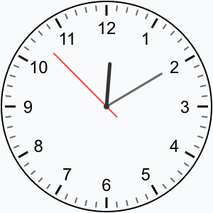
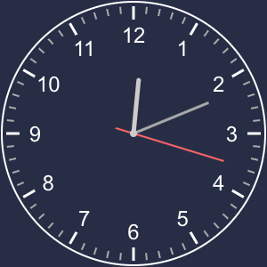

# Компонент аналоговых часов для MoonShine

[](https://packagist.org/packages/akostdev/moonshine-clock-component)
[](https://packagist.org/packages/akostdev/moonshine-clock-component)

Элегантный компонент аналоговых часов для админ-панели MoonShine с поддержкой темного режима и множеством опций для настройки.

[English documentation](README.md)

## Особенности

- Плавная анимация секундной стрелки
- Поддержка темного режима с отдельными настройками цветов
- Широкие возможности настройки внешнего вида (цвета, размеры, шрифты)
- Возможность показать/скрыть цифры циферблата

## Скриншоты




## Установка

Установка пакета через composer:

```bash
composer require akostdev/moonshine-clock-component
```

## Использование

Вы можете использовать компонент AnalogClock на страницах вашей админ-панели MoonShine:

```php
use AKostDev\MoonShine\Components\AnalogClock;

// Базовое использование с параметрами по умолчанию
AnalogClock::make()

// Часы с измененным размером
AnalogClock::make(sizePx: 300)

// Пример полной настройки
AnalogClock::make(
    sizePx: 250,
    smoothSecondHand: true,
    borderColor: '#336699',
    backgroundColor: '#f5f5f5',
    borderThickness: 3,
    centerDotColor: '#ff6600',
    showDigits: true,
    digitFont: 'Helvetica, sans-serif',
    digitColor: '#333333',
    hourHandColor: '#000000',
    minuteHandColor: '#444444',
    secondHandColor: '#ff0000'
)
```

## Параметры

Компонент принимает следующие параметры в методе `make()`:

| Параметр | Тип | По умолчанию | Описание |
|----------|-----|--------------|----------|
| `sizePx` | int | 150 | Размер часов в пикселях |
| `smoothSecondHand` | bool | true | Включает плавную анимацию секундной стрелки |
| `showDigits` | bool | true | Показать или скрыть цифры часов |
| `borderColor` | string | '#000' | Цвет границы часов (светлый режим) |
| `backgroundColor` | string | 'transparent' | Цвет фона часов (светлый режим) |
| `borderThickness` | int | 2 | Толщина границы в пикселях |
| `centerDotColor` | string | '#333' | Цвет центральной точки (светлый режим) |
| `digitFont` | string | 'Arial, sans-serif' | Шрифт для цифр |
| `digitColor` | string | '#000' | Цвет цифр (светлый режим) |
| `hourMarksThickness` | int | 3 | Толщина часовых меток в пикселях |
| `minuteMarksThickness` | int | 2 | Толщина минутных меток в пикселях |
| `hourMarksColor` | string | '#000' | Цвет часовых меток (светлый режим) |
| `minuteMarksColor` | string | '#666' | Цвет минутных меток (светлый режим) |
| `hourHandColor` | string | '#333' | Цвет часовой стрелки (светлый режим) |
| `minuteHandColor` | string | '#666' | Цвет минутной стрелки (светлый режим) |
| `secondHandColor` | string | '#FF3333' | Цвет секундной стрелки (светлый режим) |

### Параметры для темного режима

Компонент автоматически переключается на цвета темного режима, когда активирован темный режим MoonShine.

| Параметр | Тип | По умолчанию | Описание |
|----------|-----|--------------|----------|
| `hourHandColorDark` | string | '#CCC' | Цвет часовой стрелки (темный режим) |
| `minuteHandColorDark` | string | '#AAA' | Цвет минутной стрелки (темный режим) |
| `secondHandColorDark` | string | '#FF6666' | Цвет секундной стрелки (темный режим) |
| `centerDotColorDark` | string | '#CCC' | Цвет центральной точки (темный режим) |
| `digitColorDark` | string | '#FFF' | Цвет цифр (темный режим) |
| `hourMarksColorDark` | string | '#FFF' | Цвет часовых меток (темный режим) |
| `minuteMarksColorDark` | string | '#AAA' | Цвет минутных меток (темный режим) |
| `borderColorDark` | string | '#FFF' | Цвет границы часов (темный режим) |
| `backgroundColorDark` | string | 'transparent' | Цвет фона часов (темный режим) |

## Примеры

### Базовые часы

```php
AnalogClock::make()
```

### Большие часы с пользовательскими цветами

```php
AnalogClock::make(
    sizePx: 300,
    hourHandColor: '#007bff',
    minuteHandColor: '#6c757d',
    secondHandColor: '#dc3545',
    borderColor: '#28a745'
)
```

### Минималистичные часы (без цифр)

```php
AnalogClock::make(
    showDigits: false,
    backgroundColor: '#f8f9fa',
    borderThickness: 1
)
```

### Пользовательские цвета для темного режима

```php
AnalogClock::make(
    secondHandColor: '#ff0000',
    secondHandColorDark: '#ff9999',
    backgroundColorDark: '#222222'
)
```

## Лицензия

Лицензия MIT. Подробная информация в файле [License File](LICENSE.md).
